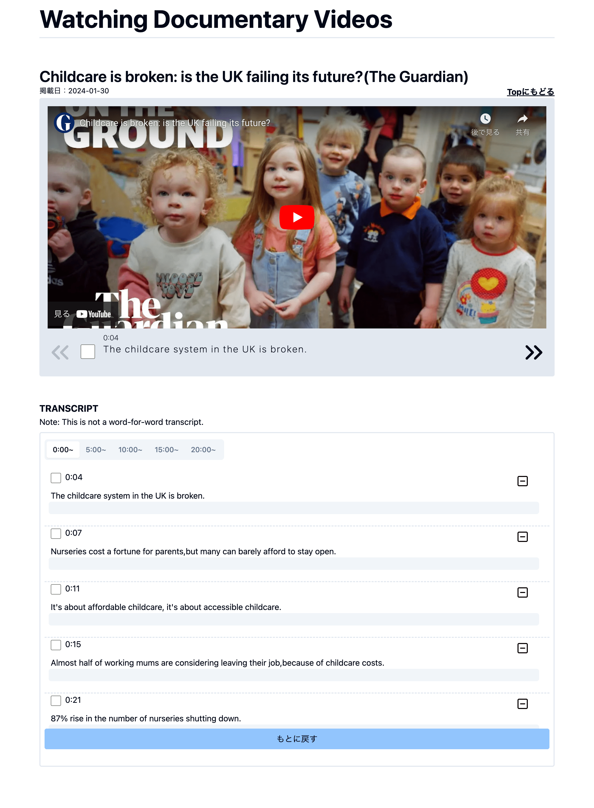

## <u>en-video-app</u>

##### <概要>

英語のドキュメンタリービデオを集めたサイトです。
動画サイトを作ってみたいと思い作成しました。
字幕が動画の再生に合わせて切り替わったり、ちょっとしたメモができる機能をつけています。
URL: https://en-video-app.vercel.app/

##### <製作日>

2023年12月（制作期間：約2週間）

##### <仕様>

- ページ上部に動画、下部に動画の文章(transcript)が配置されています。
- 動画に連動して字幕が切り替わります。
- 表示されている字幕のチェックボックスにチェックすると、transcriptの該当部分にもチェックが入ります。
- transcript部分にはメモを入力できるようになっています。
- メモ等を保存できる機能は実装されていません。

<ライブラリ選定について>
動画部分はreact-playerを使ってyoutubeの動画を再生できるようにしています。
動画に連動して字幕が切り替わる機能を実装したく、現在の再生時間を取得する必要があったためです。
初めは、video.jsで実装しようとしましたが中々上手くいかずreact-playerに切り替えました。

##### <使用技術>

Next.js13(app router), microCMS, react-player, tiptap-editor, recoil, tailwind, shadcn, typescript, etc

##### <参考URL>

<動画部分>

- [ReactPlayer](https://www.npmjs.com/package/react-player)
- [How to display aside subtitles of an embedded youtube video?](https://stackoverflow.com/questions/75462032/how-to-display-aside-subtitles-of-an-embedded-youtube-video)
- [YouTube埋め込みプレーヤーの関連動画やアレコレを非表示にしたいあなたに贈る処方箋](https://qiita.com/heppokofrontend/items/8e8ac3f9cdf34a4e360e)

<react-player使用時のhydrationerror>

- [Next.JS / React 18 – Hydration Error in cookpete React Player](https://lightrun.com/solutions/cookpete-react-player-nextjs-react-18-hydration-error/)
- [Trying to use react-player throws a Hydration error](https://stackoverflow.com/questions/72235211/trying-to-use-react-player-throws-a-hydration-error)

<react-playerでgetCurrentTimeを取得>

- [GitHub/AdonisEnProvence/MusicRoom](https://github.com/AdonisEnProvence/MusicRoom/blob/788fa78afccf5c6430213ec50aa6f1cebd6a336f/packages/client/components/YouTubePlayer/web.tsx#L26)
- [【React.js】React の ref、useRef、forwardRefについて改めてまとめてみた！](https://nonakayasuo.com/refs-basic/)
- [forwardRef と useImperativeHandle](https://numb86-tech.hatenablog.com/entry/2019/12/06/122217)
- [Type 'Promise<number>' is not assignable to type 'number'](https://stackoverflow.com/questions/55086889/type-promisenumber-is-not-assignable-to-type-number)

<Tiptap導入>

- [Tiptap editor](https://tiptap.dev/)